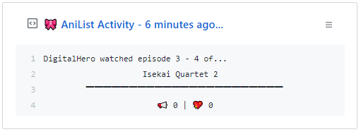

  
  <h3 align="center">Neko-Box</h3>
  
Pinnable dynamic Gist with your latest AniList activity!

***

**Neko-Box** is a simple **GitHub Action** built to make dynamic Gist displaying your latest activity from AniList.

 

## 🎉 Usage
**To start, you need to prepare some things:**
- Create a new public GitHub Gist at https://gist.github.com/

- Create an Access Token with the `gist` scope and save it.
You can do that at https://github.com/settings/tokens/new

 

**After getting this done:**
- Fork this repository.

- Go to your fork's **Settings > Secrets** page add the following secrets:
	- **`ANILIST_USERNAME`** - Your username from AniList.
	- **`GH_TOKEN`** - The access token you saved earlier.
	- **`GIST_ID`** - The ID of your newly created public Gist.  
	 You can find it in the URL and It will look like this:
	 `https://gist.github.com/RangerDigital/`**`d1b79f73d3e5a2420ed370b0059dba42`**.

 

**That's It!**  
Now every 10 minutes `schedule.yml` workflow will update your Gist,  
It's now a good idea to pin it in your profile to show off your weeb power level!

 

## 🚧 Contributing

**You are more than welcome to help me improve Neko-Box!**

Just fork this project from the `master` branch and submit a Pull Request (PR).

 

## 📃 License
This project is licensed under [GPL-3.0](https://choosealicense.com/licenses/gpl-3.0/) .
